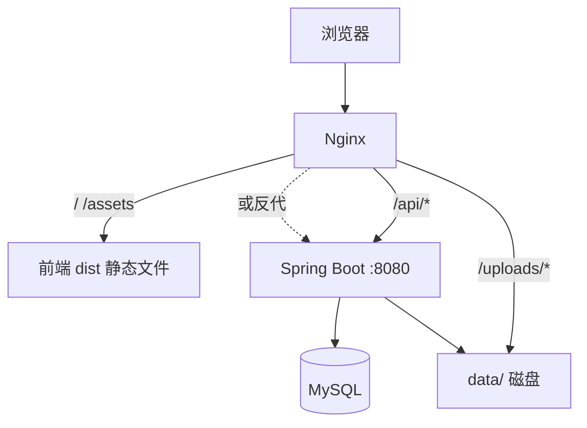
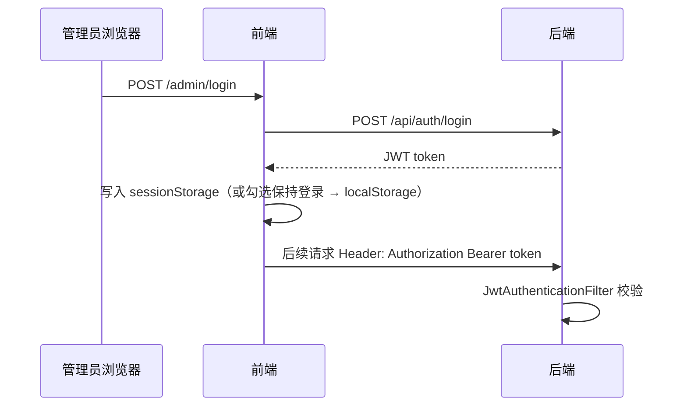

# LJL Blog 项目维护手册

> 面向新成员上手与日后自维护的全流程说明。  
> 部署步骤详见 [DEPLOY.md](./DEPLOY.md)。

---

## 1. 项目是什么

个人博客 / 知识库站点，包含：

| 能力 | 前台 | 后台 |
|------|------|------|
| 文章 Blog | `/blog` | `/admin/blog` |
| 文档 Docs | `/docs` | `/admin/docs` |
| 项目 Projects | `/projects` | `/admin/projects` |
| 旅行相册 Album | `/album` | `/admin/album` |
| 关于页 About | `/about` | `/admin/about` |
| 分类 / 标签 | 筛选、展示 | `/admin/meta` |
| 运维 | — | `/admin/maintenance` |
| 控制台 | — | `/admin/dashboard` |

**两个独立仓库目录（同一工作区）：**

```
ljl-blog/
├── ljl-blog-web/      # Vue 3 前端（Vite + Pinia + Element Plus）
└── ljl-blog-server/   # Spring Boot 3 后端（MyBatis + MySQL + JWT）
```

---

## 2. 技术栈

| 层 | 技术 |
|----|------|
| 前端 | Vue 3、TypeScript、Vite 7、Vue Router、Pinia、Sass、Element Plus、markdown-it |
| 后端 | Java 17、Spring Boot 3.5、Spring Security、JWT、MyBatis、MySQL 8 |
| 部署 | Nginx 静态托管 + 反代 `/api`、Spring Boot 可执行 fat JAR |

---

## 3. 整体架构



**请求分工：**

- 页面路由：Vue SPA，`try_files` 回退到 `index.html`
- 读写数据：`/api/**` → Spring Boot
- 图片访问：`/uploads/images/xxx` → 磁盘或后端静态映射

---

## 4. 数据存在哪里

### 4.1 MySQL（结构化元数据）

| 表 | 用途 |
|----|------|
| `users` | 管理员账号 |
| `categories` / `tags` | 分类、标签 |
| `articles` | Blog + Docs 共用（`article_type` 区分 `blog` / `doc`） |
| `article_tags` | 文章与标签多对多 |
| `photos` | 相册 |
| `projects` | 项目展示 |

**重要约束：** `articles` 使用 `UNIQUE(article_type, slug)`，Blog 与 Docs 可以有同名 slug（如都叫 `intro`）。

**脚本：**

- 新库：`src/main/resources/schema.sql`
- 老库升级：`src/main/resources/schema-migration-v2.sql`

### 4.2 磁盘 `app.storage.root`（默认 `./data`）

```
data/
├── content/
│   ├── blog/          # Blog Markdown 正文 (*.md)
│   ├── docs/          # Docs Markdown 正文 (*.md)
│   └── site/          # 关于页 JSON
│       ├── about-page.json
│       └── skills.json
└── uploads/
    └── images/        # 后台上传的图片
```

- 文章 **标题、摘要、分类** 等在 MySQL；**正文** 在 `.md` 文件
- 关于页 **不走 MySQL**，读写 JSON 文件
- 上传图片 URL 形如 `/uploads/images/20250628-xxx.jpg`

生产环境务必使用 **绝对路径**，例如 `/opt/ljl-blog/data`（见 `application-local.yml`）。

---

## 5. 本地开发全流程

### 5.1 环境要求

- Node.js 20+（前端）
- Java 17+、Maven 3.8+（后端）
- MySQL 8

### 5.2 数据库

```bash
mysql -u root -p < ljl-blog-server/src/main/resources/schema.sql
```

### 5.3 后端

```bash
cd ljl-blog-server
cp src/main/resources/application-local.yml.example src/main/resources/application-local.yml
# 编辑 datasource、jwt.secret、admin 密码、storage.root

mvn spring-boot:run
# 或 mvn -DskipTests package && java -jar target/ljl-blog-server-0.0.1-SNAPSHOT.jar
```

默认端口 **8080**。首次启动会自动创建管理员（见 `AdminInitializer`）并导入空库时的 Docs / Projects 种子（见 `*SeedInitializer`）。

### 5.4 前端

```bash
cd ljl-blog-web
cp .env.example .env.development.local
```

推荐 `.env.development.local`：

```env
VITE_USE_MOCK=false
VITE_API_BASE_URL=/api
VITE_API_PROXY_TARGET=http://localhost:8080
```

```bash
npm ci
npm run dev
```

访问 http://localhost:5173 ，后台 http://localhost:5173/admin/login 。

Vite 会把 `/api`、`/uploads` 代理到 8080（见 `vite.config.ts`）。

### 5.5 Mock 模式（仅前端、无需后端）

`.env` 中 `VITE_USE_MOCK=true` 时，API 模块读取 `src/mock/*.json`，适合纯 UI 开发。  
**上线必须 `VITE_USE_MOCK=false`。**

---

## 6. 鉴权与安全

### 6.1 流程



### 6.2 Token 存储（前端）

| 模式 | 存储 | 行为 |
|------|------|------|
| 默认 | `sessionStorage` | 关闭浏览器/标签页后需重新登录 |
| 勾选「保持登录」 | `localStorage` | 关闭浏览器后仍有效（JWT 默认 8 小时） |

实现：`ljl-blog-web/src/utils/tokenStorage.ts`

### 6.3 后端接口权限（`SecurityConfig`）

| 路径 | 权限 |
|------|------|
| `POST /api/auth/login` | 公开 |
| `GET /api/**` | 公开（前台读接口） |
| `POST/PUT/DELETE /api/**` | 需 JWT（写操作） |
| `/api/admin/**` | 需 JWT（含控制台统计 GET） |
| `/api/maintenance/**` | 需 JWT |
| `/uploads/**` | 公开 |

### 6.4 401 处理

- axios 拦截器清除 token 并跳转登录（`api/request.ts` + `main.ts`）
- 路由守卫：`requiresAuth` 路由会调用 `/api/auth/me` 校验（`router/index.ts`）

### 6.5 生产必改项

- `app.jwt.secret`（≥32 字符）
- `app.admin.password`
- 首次登录后在 **账号设置** 修改密码

---

## 7. 核心业务说明

### 7.1 Blog / Docs（共用 `ArticleService`）

- 类型枚举：`ArticleType.BLOG` / `ArticleType.DOC`
- 控制器：`BlogController`（`/api/blog`）、`DocsController`（`/api/docs`）
- 创建/更新时：写 MySQL + 保存 Markdown 到 `content/{blog|docs}/{slug}.md`
- 更新/删除时会触发 **图片引用清理**（见 7.5）

### 7.2 Projects

- 数据在 `projects` 表，JSON 字段存技术栈、截图、时间线等
- 更新/删除时清理封面与截图文件

### 7.3 About

- 读写 `data/content/site/*.json`
- 后台可编辑、可一键导入种子

### 7.4 Album

- 元数据在 `photos` 表
- `file_path` 可为本站 `/uploads/...` 或外部 `https://` URL
- 前台筛选：`GET /api/album/filters?country=` 按国家返回城市列表

### 7.5 上传与孤儿图片清理

**上传：** `POST /api/upload/image` → `FileStorageService` → `data/uploads/images/`

**引用扫描：** `ManagedUploadCleanupService` 会扫描：

- 文章/文档封面与 Markdown 内图片
- 项目封面与截图
- 相册、关于页头像等

**运维：**

- `GET /api/maintenance/orphan-images` — 扫描孤儿文件（需登录）
- `POST /api/maintenance/orphan-images/cleanup` — 删除孤儿
- `POST /api/maintenance/orphan-tags/cleanup` — 清理无文章引用的标签

**注意：** 外部 URL（如 picsum）不会被当作本站托管文件删除。

---

## 8. 示例数据导入

| 模块 | 接口 | 后台入口 | 种子文件 |
|------|------|----------|----------|
| Docs | 启动自动 | — | `seed/docs.json` + `docs-content.json` |
| Projects | 启动自动 + `POST /api/projects/seed` | 项目管理 | `seed/projects.json` |
| Blog | `POST /api/blog/seed` | 文章管理 | `seed/blog.json` + `blog-content.json` |
| Album | `POST /api/album/seed` | 相册管理 | `seed/album.json` |
| About | `POST /api/about/seed` | 关于页管理 | `seed/about-page.json` + `skills.json` |

参数 `replace=true` 时会先清空该模块已有数据再导入。

---

## 9. 前端目录速查

```
src/
├── api/
│   ├── request.ts           # axios 实例、JWT、401
│   ├── unauthorized.ts      # 401 跳转登录回调
│   └── modules/             # 按业务拆分的 API（blog、docs、album…）
├── components/
│   ├── admin/TagSelect.vue  # 后台标签多选补全
│   └── markdown/            # Markdown 渲染、目录
├── composables/             # 可复用逻辑（滚动、TOC、阅读进度）
├── layouts/
│   ├── MainLayout.vue       # 前台主布局
│   ├── AdminLayout.vue      # 后台侧边栏
│   └── ContentLayout.vue    # 文档/文章详情宽屏布局
├── mock/                    # Mock 数据（USE_MOCK=true 时使用）
├── router/index.ts          # 路由 + 鉴权守卫
├── stores/                  # Pinia（auth、blog、album、theme…）
├── utils/tokenStorage.ts    # 登录 token 存 session/local
└── views/
    ├── home|blog|docs|…     # 前台页面
    └── admin/               # 后台 CRUD 页面
```

**新增前台页面：** 在 `router/index.ts` 注册 → 在 `views/` 写组件 → 在 `api/modules/` 加接口（或复用已有）。

**新增后台功能：** 同上 + 在 `AdminLayout.vue` 加导航链接。

---

## 10. 后端目录速查

```
com.ljlblogserver/
├── config/          # Security、CORS、Storage、JWT、启动种子
├── controller/      # REST 入口（一模块一 Controller）
├── service/         # 业务逻辑
├── mapper/          # MyBatis 接口
├── entity/          # 数据库实体
├── dto/             # 请求/响应对象
├── common/          # ApiResponse、异常、ArticleType
└── security/        # JwtAuthenticationFilter
```

**新增 REST 模块惯例：**

1. `entity` + `mapper` + `mapper.xml`（若需复杂 SQL）
2. `service` 写业务
3. `controller` 暴露 `/api/xxx`
4. 写操作默认需 JWT；若需保护 GET，在 `SecurityConfig` 增加 `/api/xxx/**` authenticated

---

## 11. API 一览（常用）

| 方法 | 路径 | 说明 |
|------|------|------|
| POST | `/api/auth/login` | 登录 |
| GET | `/api/auth/me` | 当前用户 |
| PUT | `/api/auth/password` | 改密码 |
| GET | `/api/admin/dashboard` | 控制台统计 |
| GET/POST | `/api/blog/**` | 文章 |
| GET/POST | `/api/docs/**` | 文档 |
| GET/POST | `/api/projects/**` | 项目 |
| GET/POST | `/api/album/**` | 相册 |
| GET/PUT | `/api/about/**` | 关于页 |
| GET/POST | `/api/meta/**` | 分类标签 |
| POST | `/api/upload/image` | 上传图片 |
| GET | `/api/maintenance/orphan-images` | 孤儿扫描 |

统一响应格式：

```json
{ "code": 0, "message": "ok", "data": { ... } }
```

`code !== 0` 表示业务错误；HTTP 401 表示未登录或 token 失效。

---

## 12. 构建与部署（摘要）

详细步骤见 **[DEPLOY.md](./DEPLOY.md)**。

```bash
# 后端 fat JAR（必须用此文件，不要用 .jar.original）
cd ljl-blog-server && mvn -DskipTests clean package
java -jar target/ljl-blog-server-0.0.1-SNAPSHOT.jar

# 前端
cd ljl-blog-web
# 配置 .env.production：VITE_USE_MOCK=false, VITE_API_BASE_URL=/api
npm ci && npm run build
# 上传 dist/ 到 Nginx
```

**常见部署坑：**

| 现象 | 原因 | 处理 |
|------|------|------|
| `NoClassDefFoundError`（multipart、tomcat） | 跑了瘦 jar `.original` 或 jar 损坏 | 用 ~31MB 的 fat jar，`java -jar` 启动 |
| 上传成功但图片 404 | Nginx 未配置 `/uploads/` | `location ^~ /uploads/` 见 DEPLOY |
| 后台 401 | token 过期或未勾选保持登录后关浏览器 | 重新登录 |
| Blog/Docs 保存失败 slug 冲突 | 同类型下 slug 重复 | 换 slug；Blog 与 Doc 可同名 |

---

## 13. 日常维护清单

**备份（建议 cron）：**

```bash
mysqldump -u ljl_blog -p ljl_blog > backup-$(date +%F).sql
tar czf data-backup-$(date +%F).tar.gz /opt/ljl-blog/data/content /opt/ljl-blog/data/uploads
```

**更新版本：**

1. 拉代码 → 如有 DB 变更跑 migration 脚本
2. `mvn package` → 替换 jar → 重启 Java 服务
3. `npm run build` → 替换 Nginx 下 dist
4.  smoke test：首页、一篇 Blog、上传一张图、后台登录

**内容运营：**

- 分类 slug 与后台下拉一致（`categories` 表）
- 删文章后可在运维工具扫孤儿图
- 标签在 Meta 管理；编辑页支持自动补全

---

## 14. 新人上手 Checklist

- [ ] 读完本文 + DEPLOY.md 架构图
- [ ] 本地 MySQL + 后端 8080 + 前端 5173 跑通
- [ ] 用 Mock 模式浏览前台，再用 `VITE_USE_MOCK=false` 对接 API
- [ ] 登录后台，走一遍：新建文章 → 上传封面与正文图 → 前台查看
- [ ] 理解 `data/` 与 MySQL 分工
- [ ] 知道 fat jar 与 `.jar.original` 区别
- [ ] 生产改 JWT secret、管理员密码

---

## 15. 扩展开发建议

| 需求 | 建议改动位置 |
|------|----------------|
| 新前台栏目 | `views/` + `router` + `api/modules` + 可选 `stores` |
| 新后台模块 | 同上 + `AdminLayout` 导航 + 后端 Controller/Service |
| 站点全局配置 | 尚未实现；可新增 `site_settings` 表或 JSON 配置 |
| 草稿/发布状态 | 需改 `articles` 表 + 前后台列表筛选 |
| 评论 | 新表 + 新模块，与现有架构独立 |

**代码风格（项目约定）：**

- 注释只写非显而易见的业务逻辑，避免逐行翻译代码
- 前端错误操作统一 `ElMessage` 提示
- 改 slug / 删内容时注意 `ManagedUploadCleanupService` 是否需接入

---

## 16. 文档索引

| 文档 | 内容 |
|------|------|
| [HANDBOOK.md](./HANDBOOK.md) | 本文：架构、开发、维护全流程 |
| [DEPLOY.md](./DEPLOY.md) | 生产部署、Nginx、HTTPS、图片 404 排查 |
| `docs/nginx-site.conf` | Nginx 站点配置示例 |

如有模块行为与文档不一致，以代码为准，并请及时更新本文。
